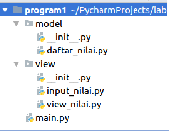

# Project UAS

Pada pertemuan ini saya akan membuat program dengan package dan modul dengan struktur sebagai berikut :

* daftar_nilai.py berisi modul untuk : tambah_data, ubah_data, hapus_data, dan cari_data.
* view_nilai.py berisi modul untuk : cetak_daftar_nilai, cetak_hasil_pencarian.
* input_nilai.py berisi modul untuk : input_data yang meminta pengguna memasukkan data.
* main.py berisi program utama (menu pilihan yang memanggil semua menu yang ada.)

## Dokumentasi

Untuk dokumentasi dapat di download melalui <a href="Project_UAS.pdf">Dokumentasi</a>

## Demo Program

Untuk demo program bisa dilihat dengan cara mengunjungi <a href="https://youtu.be/1gf95gE-o2A">Demo Program</a>